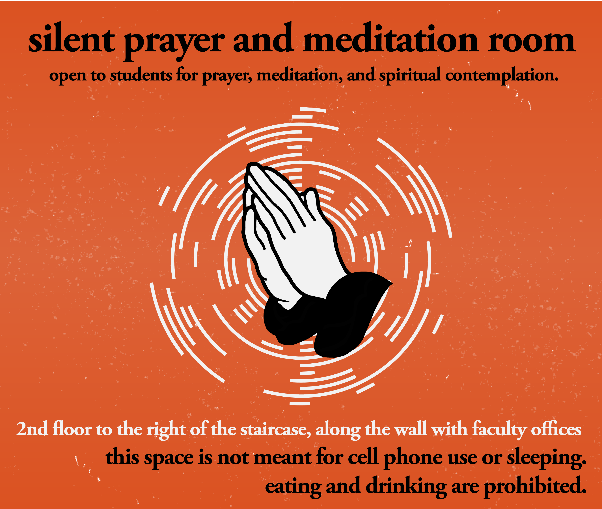
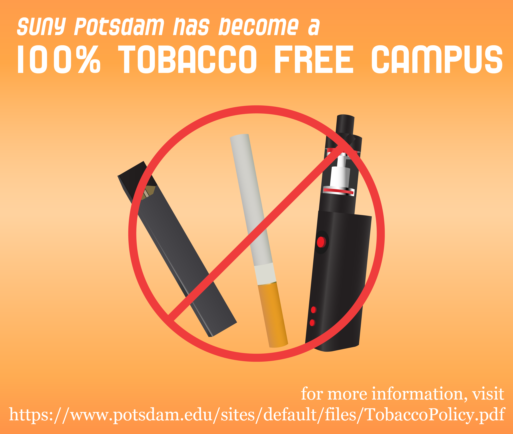
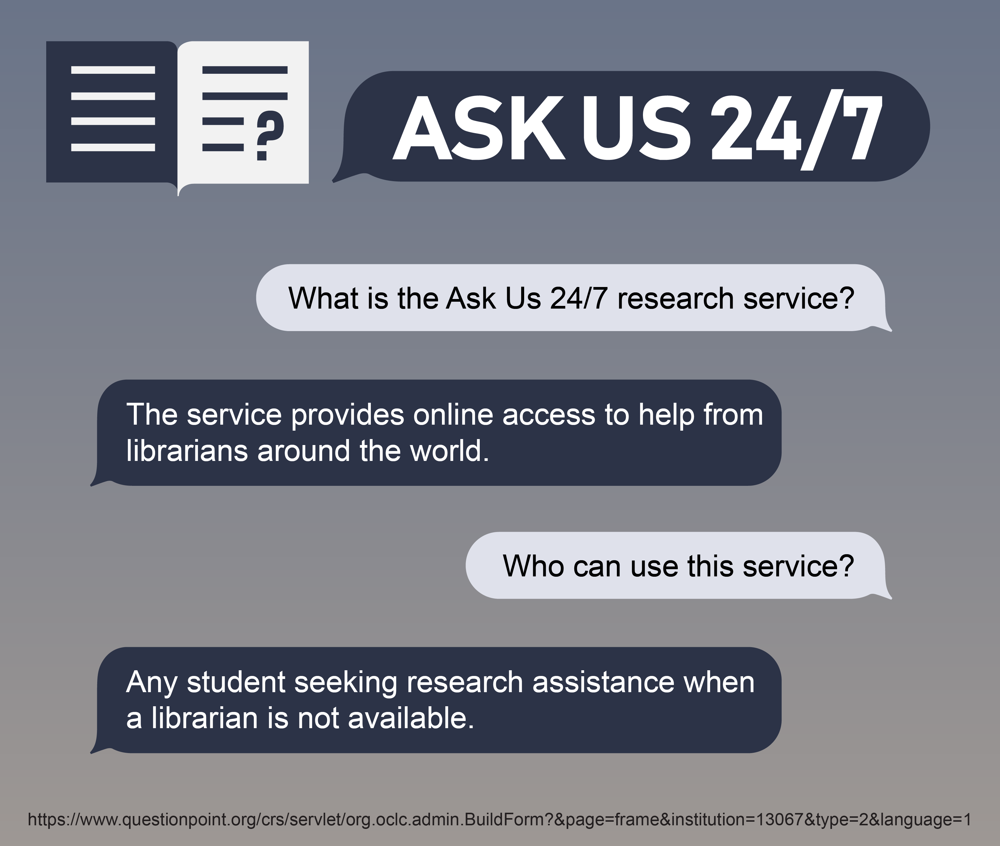

# Graphic Design Portfolio
This is a portfolio of my work for the Lougheed Learning Commons at SUNY Potsdam, as well as my personal works.

### For the Lougheed Learning Commons:

### Personal Works:

|  |
| -------------------------- |
|  |

|  |  |  |
| ---------------------------------- | ---------------------------------- | ------------------------------------ |

|  |
| -------------- |

|  |  |  |
| - | - | - |
