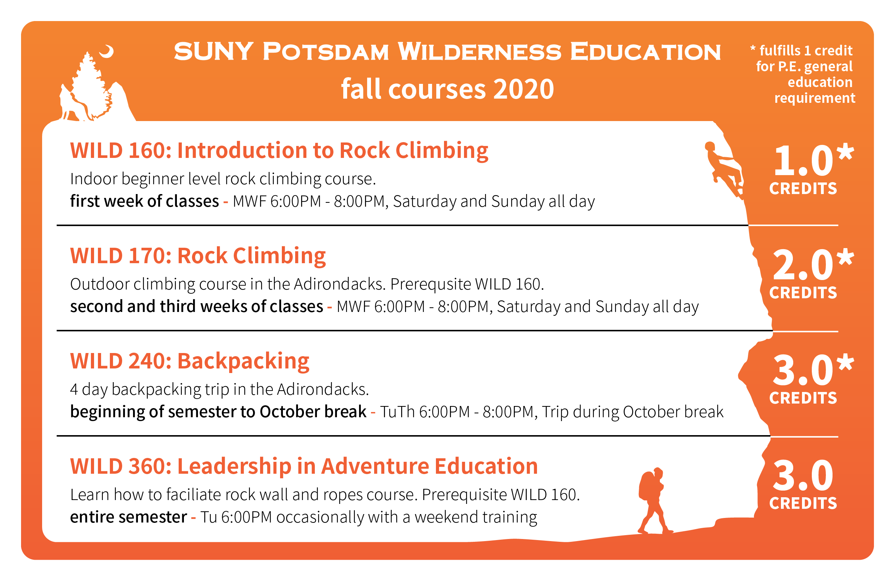
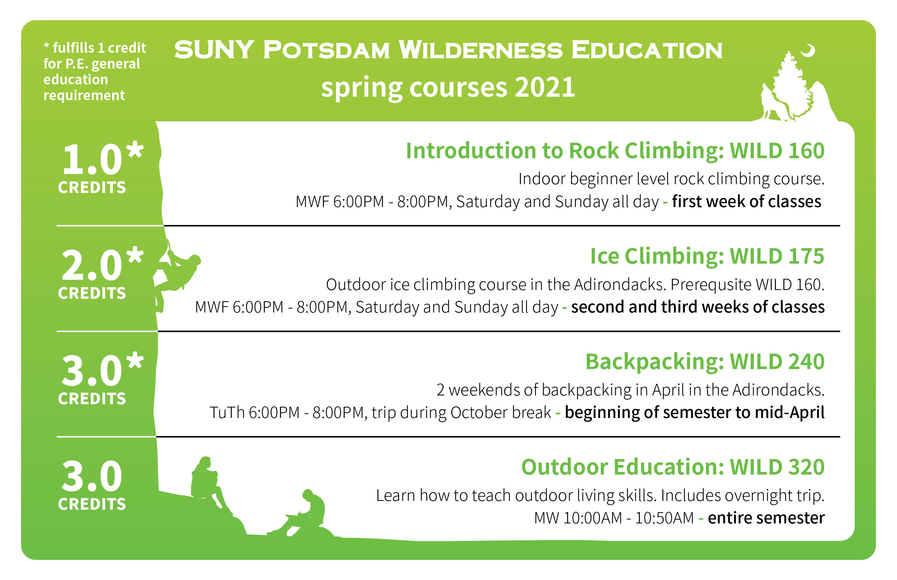
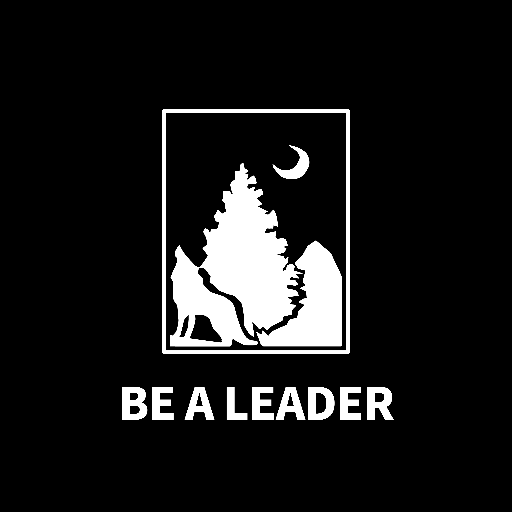
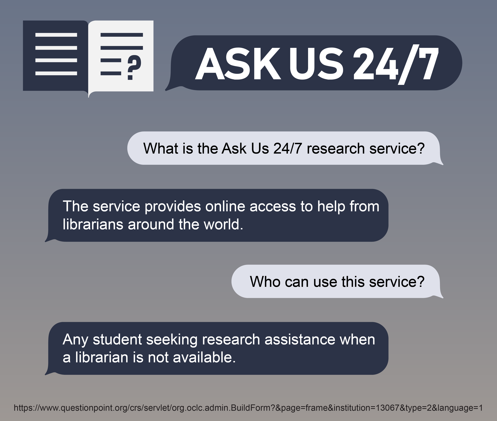
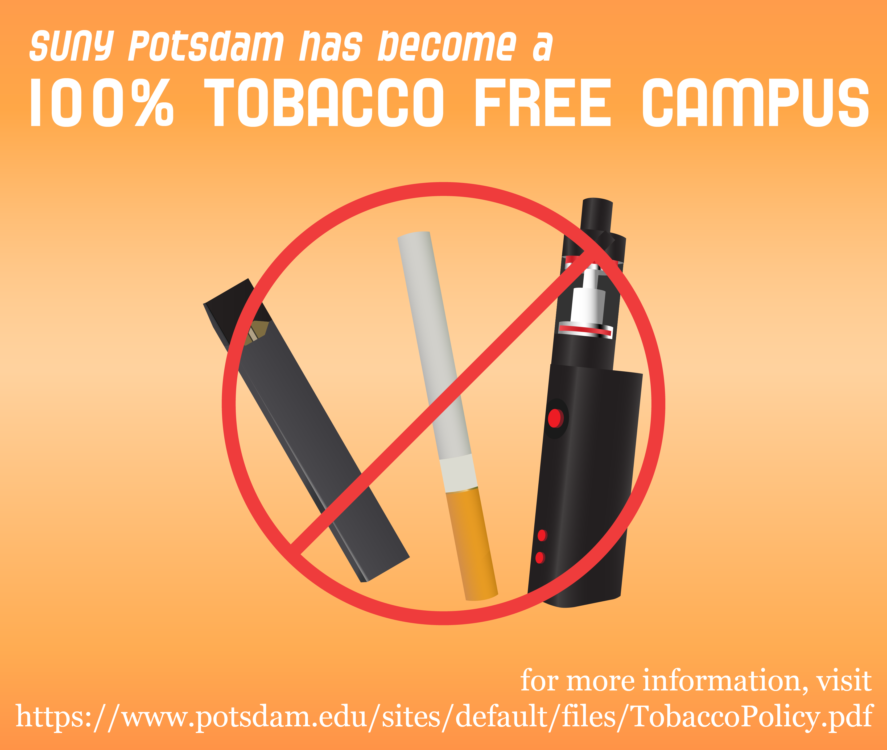
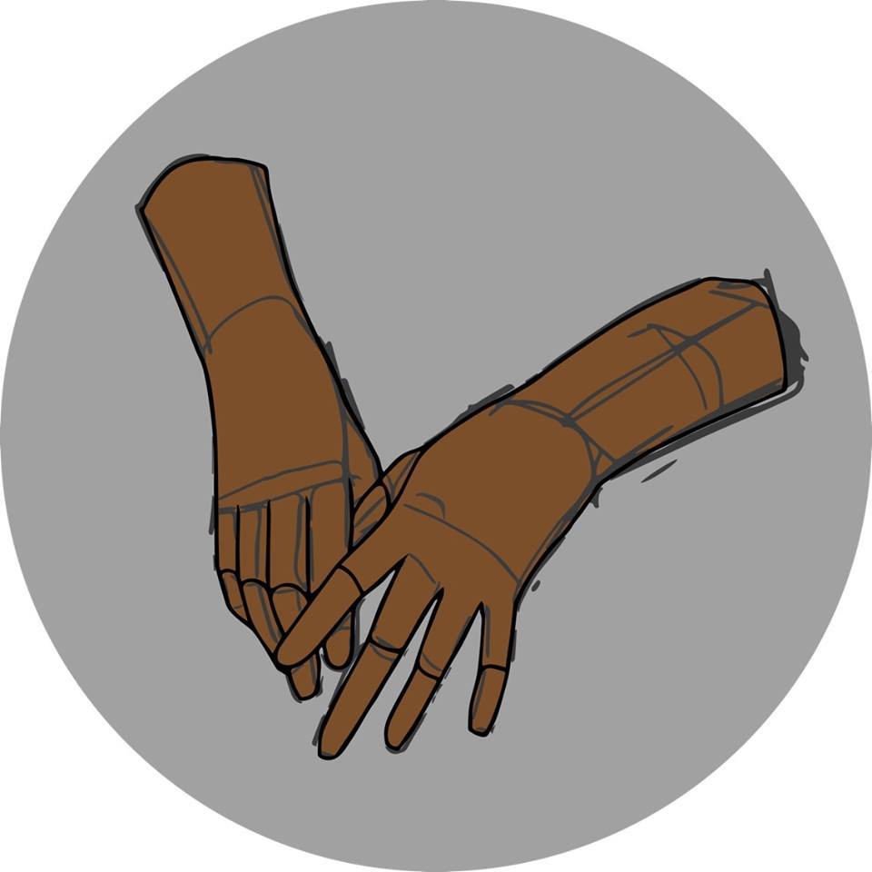

# Graphic Design Portfolio
This is a portfolio of various work by Bastien Gliech.

### For the SUNY Potsdam Wilderness Education Minor

### For the SUNY Potsdam Lougheed Learning Commons:

|  |  |
| ----------------------- | --------- |

<<<<<<< HEAD

=======
|  |
| -------------- |

|  |  |  |
| - | - | - |
>>>>>>> 4fc0bfd2f3f32ad36380b2075fe3ea92da16ce63
